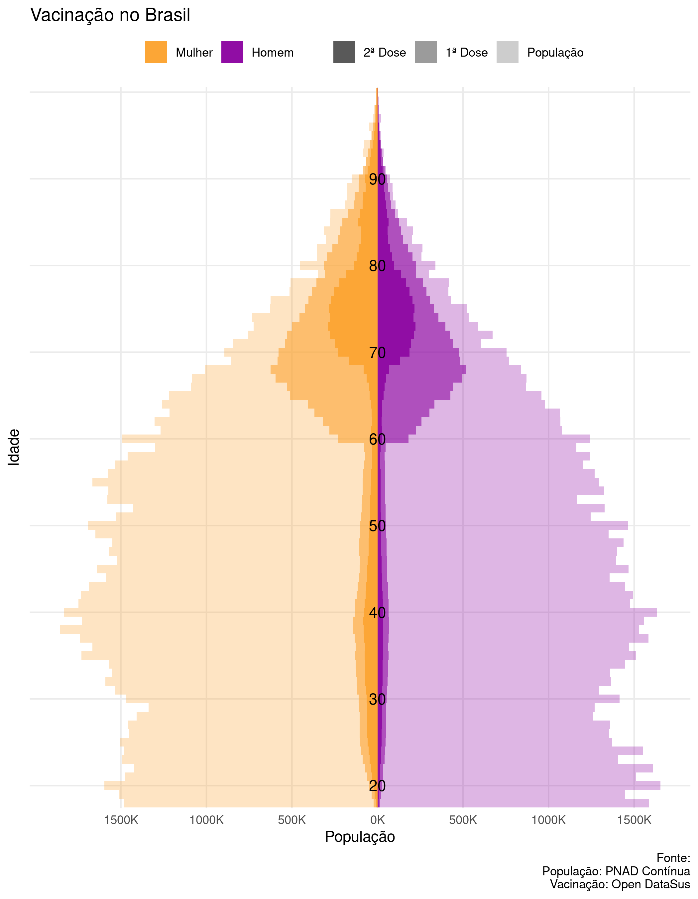

<!-- README.md is generated from README.Rmd. Please edit that file -->

# vacinaBrasil

<!-- badges: start -->
<!-- badges: end -->

The goal of vacinaBrasil is to …

## Installation

``` r
library(ggplot2)
library(vacinaBrasil)

fonte <- stringr::str_glue(
  "Fonte:\n",
  "População: PNAD Contínua\n",
  "Vacinação: Open DataSus"
)

dose <- datasus_idade_sexo_dose %>% 
  dplyr::select(sexo, idade, tipo = dose, n) %>% 
  dplyr::filter(tipo %in% c("1ª Dose", "2ª Dose"))

pop <- pop_idade_sexo %>% 
  dplyr::transmute(
    sexo,
    idade = as.numeric(idade),
    tipo = "População",
    n = pop 
  ) %>% 
  dplyr::filter(idade <= 100, idade >= 18)

dados <- dplyr::bind_rows(pop, dose)

dados %>% 
  dplyr::mutate(n = n * ((sexo == "Homem") * 2 -1)) %>% 
  dplyr::mutate(tipo = forcats::lvls_reorder(tipo, c(2, 1, 3))) %>% 
  ggplot(aes(x = n, y = factor(idade), fill = sexo, alpha = tipo)) +
  geom_col(width = 1, position = "identity") +
  annotate(geom = "text", x = 0, y = seq(3, 73, 10), label = seq(20, 90, 10)) +
  scale_x_continuous(
    breaks = seq(-1500, 1500, 500) * 1000,
    labels = paste0(abs(seq(-1500, 1500, 500)), "K")
  ) +
  scale_y_discrete(breaks = seq(0, 100, 10)) + 
  scale_fill_viridis_d(begin = .3, end = .8, option = "C") +
  scale_alpha_manual(values = c(1, .6, .3)) +
  theme_minimal() +
  labs(
    x = "População", 
    y = "Idade",
    fill = "",
    alpha = "",
    title = "Vacinação no Brasil",
    caption = fonte
  ) +
  guides(fill = guide_legend(reverse = TRUE)) +
  theme(
    panel.grid.minor = element_blank(),
    axis.text.y = element_blank(),
    legend.position = "top",
    title = element_text(hjust = .5)
  )
```



## Example
